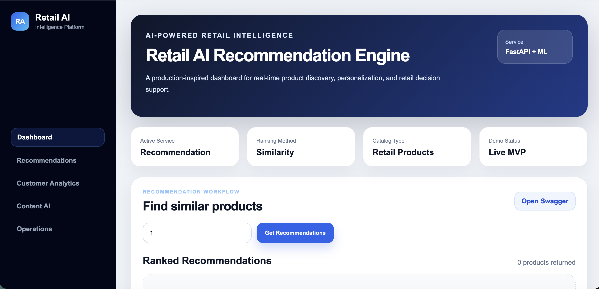
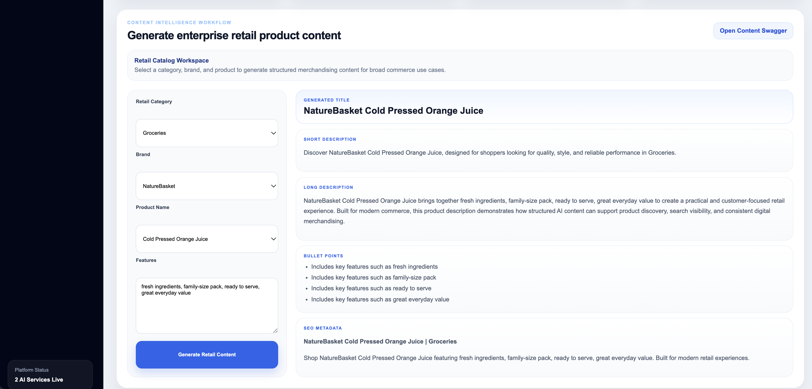
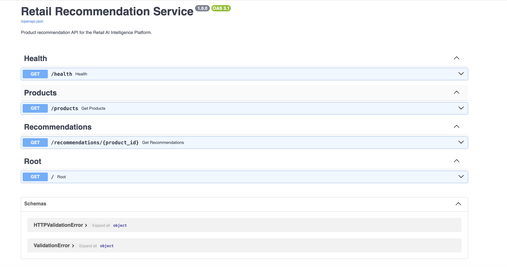

# 🛒 Retail AI Intelligence Platform

A production-inspired AI platform for retail intelligence, designed for large-scale commerce environments including grocery, electronics, fashion, and general merchandise.

---

## 🚀 Why This Project Matters

Modern retail systems require more than isolated machine learning models.

They need intelligent platforms that can:

- Understand customer behavior
- Recommend relevant products
- Generate high-quality product content
- Retrieve retail knowledge intelligently
- Provide actionable business insights

This project demonstrates how AI can be applied across the entire retail lifecycle using scalable AI services and modern commerce workflows.

---

# ✨ Key Features

- Multi-service Retail AI platform
- Recommendation workflows
- OpenAI-powered content generation
- Retail AI RAG assistant
- Semantic retail search
- ChromaDB vector database integration
- Dockerized microservices architecture
- React enterprise-style frontend
- FastAPI backend services
- Retail-focused AI workflows

---

## 🚀 Quick Start (Docker)

Run the full platform:

```bash
docker compose up --build
```

Open:

- UI → http://localhost:5173
- Recommendation API → http://localhost:8001/docs
- Content Intelligence API → http://localhost:8002/docs
- RAG Assistant API → http://localhost:8003/docs

---

## 🐳 Docker Hub Images

This platform is published as multiple Docker images:

- Frontend: https://hub.docker.com/r/noopur17/retail-ai-frontend
- Recommendation Service: https://hub.docker.com/r/noopur17/retail-recommendation-service
- Content Intelligence Service: https://hub.docker.com/r/noopur17/retail-content-intelligence-service

---

# 🏗️ Platform Architecture

```text
Retail AI Intelligence Platform
│
├── Frontend (React + Vite)
│
├── Recommendation Service
│   ├── Product similarity search
│   ├── Retail recommendation workflows
│   └── FastAPI microservice
│
├── Content Intelligence Service
│   ├── OpenAI-powered content generation
│   ├── SEO metadata generation
│   └── Product merchandising workflows
│
└── Retail AI RAG Assistant Service
    ├── Retail knowledge ingestion
    ├── OpenAI embeddings
    ├── ChromaDB vector storage
    ├── Semantic retrieval
    └── AI-powered retail Q&A
```

---

# 🧠 Retail AI RAG Workflow

```text
Retail Knowledge Base
        ↓
Document Loading
        ↓
Chunking
        ↓
OpenAI Embeddings
        ↓
ChromaDB Vector Store
        ↓
Semantic Retrieval
        ↓
OpenAI Answer Generation
```

---

## 🔌 Services

| Service | Description | Port |
|---|---|---|
| Frontend | React enterprise dashboard | 5173 |
| Recommendation Service | Retail recommendation workflows | 8001 |
| Content Intelligence Service | AI-powered product content generation | 8002 |
| RAG Assistant Service | Retail knowledge retrieval and AI Q&A | 8003 |

---

## 🧠 Core Modules

### 🔹 Recommendation Service

- Content-based recommendation engine
- Similarity-based ranking
- Category-aware filtering
- Retail product discovery workflows

### 🔹 Content Intelligence Service

- OpenAI-powered product content generation
- Product titles and descriptions
- Bullet points and structured content
- SEO metadata generation

### 🔹 Retail AI RAG Assistant Service

- Retail knowledge ingestion
- OpenAI embeddings
- ChromaDB vector search
- Semantic retrieval
- AI-generated retail answers
- Retail merchandising intelligence

### 🔹 Customer Analytics Service *(Planned)*

- Customer segmentation
- Behavioral insights
- Retail engagement analysis

### 🔹 Log Intelligence Service *(Planned)*

- Operational intelligence
- AI-assisted error analysis
- Monitoring workflows

---

## 🤖 AI Capabilities

- Recommendation systems
- Semantic vector search
- OpenAI embeddings
- Retrieval-Augmented Generation (RAG)
- AI-powered content generation
- Retail intelligence workflows
- Product discovery systems

---

## 🖼️ Demo Screenshots

### 🛒 Retail AI Dashboard



---

### 🤖 AI Recommendation Engine


---

### 🧠 Content Intelligence Service

AI-generated retail product content with titles, descriptions, bullet points, and SEO metadata.



---

### 🧠 Retail AI RAG Assistant

Semantic retail knowledge retrieval and AI-powered question answering.


---

### ⚙️ Backend API (Swagger)



---

## 🛠️ Tech Stack

### Frontend
- React
- Vite
- JavaScript

### Backend
- FastAPI
- Python
- REST APIs

### AI / ML
- OpenAI
- ChromaDB
- Scikit-learn
- Pandas
- Vector Embeddings

### Infrastructure
- Docker
- Docker Compose
- Docker Hub

### Domain Focus
- Retail AI
- Commerce Intelligence
- Product Discovery
- AI-powered Content Systems

---

## 📊 Dataset Connection

This platform is designed for multi-category retail systems including:

- Grocery
- Electronics
- Fashion
- Home
- General Merchandise

### Current Data Sources

- Retail product catalog datasets
- Retail knowledge base documents
- AI-generated merchandising workflows

### Supported Retail Intelligence Features

- Product similarity search
- Recommendation scoring
- AI-generated product content
- Semantic retail knowledge retrieval
- AI-assisted merchandising workflows

---

## 📂 Project Structure

```text
retail-ai-intelligence-platform/
├── docs/
│   └── screenshots/
├── frontend/
├── services/
│   ├── recommendation-service/
│   ├── content-intelligence-service/
│   ├── rag-assistant-service/
│   ├── customer-analytics-service/
│   └── log-intelligence-service/
├── datasets/
├── notebooks/
└── docker-compose.yml
```

---

## 🔌 API Documentation

### Recommendation Service

```text
http://localhost:8001/docs
```

### Content Intelligence Service

```text
http://localhost:8002/docs
```

### Retail AI RAG Assistant Service

```text
http://localhost:8003/docs
```

---

## 🧪 Local Development

### Recommendation Service

```bash
cd services/recommendation-service
uvicorn app.main:app --reload --port 8001
```

### Content Intelligence Service

```bash
cd services/content-intelligence-service
uvicorn app.main:app --reload --port 8002
```

### RAG Assistant Service

```bash
cd services/rag-assistant-service

python3 -m venv venv
source venv/bin/activate

python -m pip install -r requirements.txt

export OPENAI_API_KEY="your_api_key_here"

python -m uvicorn app.main:app --reload --port 8003
```

### Frontend

```bash
cd frontend/frontend
npm install
npm run dev
```

---

## 🔬 Research & Engineering Alignment

This platform explores practical applications of:

- Retail recommendation systems
- AI-powered content generation
- Retrieval-Augmented Generation (RAG)
- Semantic search systems
- Retail intelligence workflows
- Scalable AI platform engineering

---

## 🛣️ Roadmap

- [x] Recommendation Engine API
- [x] Content Intelligence Service
- [x] OpenAI Integration
- [x] Retail AI RAG Assistant
- [x] ChromaDB Vector Search
- [x] Dockerized Full Platform
- [x] Enterprise-style React Dashboard
- [ ] Frontend RAG Assistant Integration
- [ ] Customer Analytics Service
- [ ] Kaggle Dataset Integration
- [ ] Customer Review Ingestion
- [ ] Retail Analytics Dashboard
- [ ] Conversation Memory
- [ ] End-to-End Retail AI Simulation

---

## 👩‍💻 Author

**Noopur Bhatt**

AI & Full-Stack Engineer focused on:

- Retail AI Systems
- Recommendation Workflows
- Generative AI Applications
- Intelligent Commerce Platforms
- Scalable AI Services

---

## ⭐ Future Vision

This platform aims to evolve into a production-inspired Retail AI ecosystem demonstrating how recommendation systems, generative AI, semantic retrieval, and intelligent commerce workflows can work together in modern retail platforms.