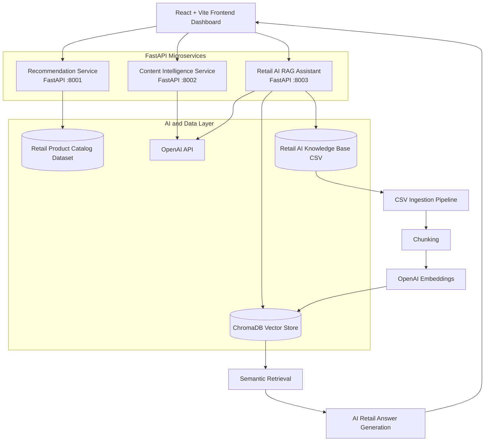

# 🛒 Retail AI Intelligence Platform

An enterprise-inspired AI platform for intelligent commerce systems, semantic retail search, recommendation workflows, and Retrieval-Augmented Generation (RAG).

Designed to demonstrate how modern AI systems can power large-scale retail ecosystems across grocery, electronics, fashion, home, and general merchandise commerce platforms.


---

# 🚀 Vision

Modern commerce platforms require more than isolated machine learning models.

They require intelligent systems capable of:

- Understanding customer behavior
- Delivering personalized recommendations
- Generating AI-powered product content
- Retrieving retail knowledge semantically
- Assisting merchandising workflows
- Powering intelligent commerce experiences

This project demonstrates how multiple AI services can work together inside a scalable Retail AI platform architecture.

---

# ✨ Platform Highlights

- 🧠 Retail AI RAG Assistant
- 🤖 Recommendation Intelligence Engine
- ✍️ AI-Powered Content Generation
- 🔎 Semantic Commerce Search
- 🗂️ ChromaDB Vector Database Integration
- ⚡ OpenAI Embeddings & Retrieval
- 🐳 Dockerized Microservices Platform
- 🛍️ Retail Knowledge Base Workflows
- 📊 Enterprise Retail Intelligence Architecture
- 🚀 React + FastAPI Production-Inspired Stack

---

# 📚 Documentation

| Document | Description |
|---|---|
| [Platform Architecture](docs/architecture/platform-architecture.md) | High-level Retail AI platform architecture |
| [RAG Architecture](docs/architecture/rag-architecture.md) | Semantic retrieval and vector search workflows |
| [Service Architecture](docs/architecture/service-architecture.md) | FastAPI microservice interactions |
| [Dataset Documentation](docs/datasets/retail-ai-knowledge-base.md) | Retail AI dataset design and schema |
| [Local Development](docs/setup/local-development.md) | Local setup and development workflow |
| [Roadmap](docs/roadmap.md) | Future platform direction |
| [Research Alignment](docs/research-alignment.md) | AI engineering and research areas |

---

# 🏗️ Platform Architecture

## Visual Architecture Diagram



```text
Retail AI Intelligence Platform
│
├── Frontend (React + Vite)
│
├── Recommendation Intelligence Service
│   ├── Product similarity search
│   ├── Recommendation scoring
│   ├── Category-aware discovery
│   └── Retail recommendation workflows
│
├── Content Intelligence Service
│   ├── OpenAI-powered product content
│   ├── SEO metadata generation
│   ├── Product merchandising workflows
│   └── Retail content intelligence
│
├── Retail AI RAG Assistant Service
│   ├── Retail knowledge ingestion
│   ├── OpenAI embeddings
│   ├── ChromaDB vector storage
│   ├── Semantic retrieval
│   ├── AI-powered retail Q&A
│   └── Commerce intelligence workflows
│
├── Customer Analytics Service (Planned)
│
└── Log Intelligence Service (Planned)
````

---

# 🧠 Retail AI RAG Workflow

```text
Retail Knowledge Base
        ↓
Document Ingestion
        ↓
Chunking Pipeline
        ↓
OpenAI Embeddings
        ↓
ChromaDB Vector Store
        ↓
Semantic Retrieval
        ↓
Context Injection
        ↓
LLM Response Generation
        ↓
Retail AI Assistant
```

---

# 🔌 Platform Services

| Service                      | Description                           | Port |
| ---------------------------- | ------------------------------------- | ---- |
| Frontend Dashboard           | Enterprise retail AI interface        | 5173 |
| Recommendation Service       | Recommendation intelligence workflows | 8001 |
| Content Intelligence Service | AI-powered product content generation | 8002 |
| Retail AI RAG Assistant      | Semantic retail retrieval & AI Q&A    | 8003 |

---

# 🧩 Core AI Services

## 🛒 Recommendation Intelligence Service

AI-powered retail recommendation workflows for product discovery and similarity search.

### Features

* Product similarity scoring
* Category-aware recommendations
* Semantic recommendation workflows
* Retail product discovery
* Recommendation ranking engine

---

## ✍️ Content Intelligence Service

Generative AI workflows for retail product content and merchandising systems.

### Features

* AI-generated product titles
* Product descriptions
* SEO metadata generation
* Bullet point generation
* Merchandising content workflows
* OpenAI-powered content systems

---

## 🧠 Retail AI RAG Assistant Service

A Retrieval-Augmented Generation (RAG) service designed for intelligent commerce retrieval workflows.

### Features

* Retail knowledge ingestion
* OpenAI embeddings
* ChromaDB vector search
* Semantic retrieval
* AI-powered retail Q&A
* Retail merchandising intelligence
* Commerce knowledge workflows
* RAG-ready retrieval pipelines

---

## 📊 Customer Analytics Service *(Planned)*

Future customer intelligence workflows.

### Planned Features

* Customer segmentation
* Behavioral intelligence
* Engagement analysis
* AI-powered customer insights
* Retail analytics workflows

---

## ⚙️ Log Intelligence Service *(Planned)*

Operational AI workflows for monitoring and intelligence systems.

### Planned Features

* AI-assisted log analysis
* Operational intelligence
* Intelligent monitoring workflows
* Production issue insights

---

# 🤖 AI Capabilities

This platform explores practical AI applications for modern commerce systems.

## Supported Workflows

* Retrieval-Augmented Generation (RAG)
* Recommendation systems
* Semantic vector search
* AI-powered content generation
* Retail intelligence workflows
* Product discovery systems
* Semantic commerce retrieval
* AI merchandising assistants
* OpenAI embedding pipelines

---

# 📊 Retail AI Knowledge Base Dataset

This platform is connected with the Kaggle dataset:

## 🧠 Retail AI Intelligence Knowledge Base

A large-scale AI-ready dataset designed for:

* Semantic retrieval
* Recommendation systems
* RAG workflows
* Retail AI assistants
* Commerce intelligence systems

### Dataset Features

* 100K+ retail intelligence records
* Multi-category retail coverage
* AI use case mappings
* Semantic retrieval tags
* Merchandising strategies
* Customer segment intelligence

---

# 📓 Premium Kaggle Notebook

The project also includes a premium Kaggle notebook focused on:

* RAG workflows
* Semantic retrieval
* Retail AI intelligence
* Recommendation analysis
* Commerce AI insights
* AI-ready dataset engineering

---

# 🐳 Dockerized Architecture

Run the entire platform locally using Docker Compose.

## Start Platform

```bash
docker compose up --build
```

---

## Service URLs

| Service                  | URL                                                      |
| ------------------------ | -------------------------------------------------------- |
| Frontend Dashboard       | [http://localhost:5173](http://localhost:5173)           |
| Recommendation API       | [http://localhost:8001/docs](http://localhost:8001/docs) |
| Content Intelligence API | [http://localhost:8002/docs](http://localhost:8002/docs) |
| Retail AI RAG API        | [http://localhost:8003/docs](http://localhost:8003/docs) |

---

# 🐳 Docker Hub Images

## Frontend

```text
https://hub.docker.com/r/noopur17/retail-ai-frontend
```

## Recommendation Service

```text
https://hub.docker.com/r/noopur17/retail-recommendation-service
```

## Content Intelligence Service

```text
https://hub.docker.com/r/noopur17/retail-content-intelligence-service
```

---

# 🖼️ Demo Screenshots

## 🛒 Retail AI Dashboard


---

## 🤖 Recommendation Intelligence


---

## ✍️ Content Intelligence


---

## 🧠 Retail AI RAG Assistant


---

## ⚙️ FastAPI Swagger APIs


---

# 🛠️ Tech Stack

## Frontend

* React
* Vite
* JavaScript

## Backend

* FastAPI
* Python
* REST APIs

## AI / ML

* OpenAI
* ChromaDB
* Scikit-learn
* Pandas
* Vector Embeddings

## Infrastructure

* Docker
* Docker Compose
* Docker Hub

---

# 📂 Project Structure

```text
retail-ai-intelligence-platform/
│
├── docs/
│   └── screenshots/
│
├── frontend/
│
├── services/
│   ├── recommendation-service/
│   ├── content-intelligence-service/
│   ├── rag-assistant-service/
│   ├── customer-analytics-service/
│   └── log-intelligence-service/
│
├── datasets/
│
├── notebooks/
│
└── docker-compose.yml
```

---

# 🔌 API Documentation

## Recommendation Service

```text
http://localhost:8001/docs
```

## Content Intelligence Service

```text
http://localhost:8002/docs
```

## Retail AI RAG Assistant Service

```text
http://localhost:8003/docs
```

---

# 🧪 Local Development

## Recommendation Service

```bash
cd services/recommendation-service
python -m uvicorn app.main:app --reload --port 8001
```

---

## Content Intelligence Service

```bash
cd services/content-intelligence-service
python -m uvicorn app.main:app --reload --port 8002
```

---

## Retail AI RAG Assistant Service

```bash
cd services/rag-assistant-service

python3 -m venv venv
source venv/bin/activate

python -m pip install -r requirements.txt

export OPENAI_API_KEY="your_api_key_here"

python -m uvicorn app.main:app --reload --port 8003
```

---

## Frontend

```bash
cd frontend/frontend

npm install
npm run dev
```

---

# 🔬 Research & Engineering Areas

This project explores practical applications of:

* Recommendation systems
* Retrieval-Augmented Generation (RAG)
* Semantic search systems
* Retail intelligence workflows
* Commerce AI systems
* Generative AI applications
* Intelligent retrieval pipelines
* Enterprise AI platform engineering

---

# 🛣️ Platform Roadmap

## Completed

* [x] Recommendation Intelligence API
* [x] Content Intelligence Service
* [x] OpenAI Integration
* [x] Retail AI RAG Assistant
* [x] ChromaDB Vector Search
* [x] Dockerized Platform
* [x] Enterprise-style React Dashboard
* [x] Kaggle Retail AI Dataset
* [x] Premium Kaggle Notebook

---

## Planned

* [ ] Frontend RAG Chat Integration
* [ ] Customer Analytics Service
* [ ] Customer Review Ingestion
* [ ] Retail Analytics Dashboard
* [ ] Conversation Memory
* [ ] AI Shopping Assistant
* [ ] Recommendation Feedback Loop
* [ ] End-to-End Retail AI Simulation

---

# 👩‍💻 Author

## Noopur Bhatt

AI & Full-Stack Engineer focused on:

* Retail AI Systems
* Retrieval-Augmented Generation (RAG)
* Recommendation Workflows
* Generative AI Applications
* Intelligent Commerce Platforms
* Semantic Retrieval Systems
* Scalable AI Services

---

# ⭐ Future Vision

The long-term vision of this project is to evolve into a production-inspired Retail AI ecosystem demonstrating how:

* recommendation systems,
* generative AI,
* semantic retrieval,
* vector search,
* intelligent merchandising,
* and commerce AI workflows

can work together inside modern enterprise retail platforms.
