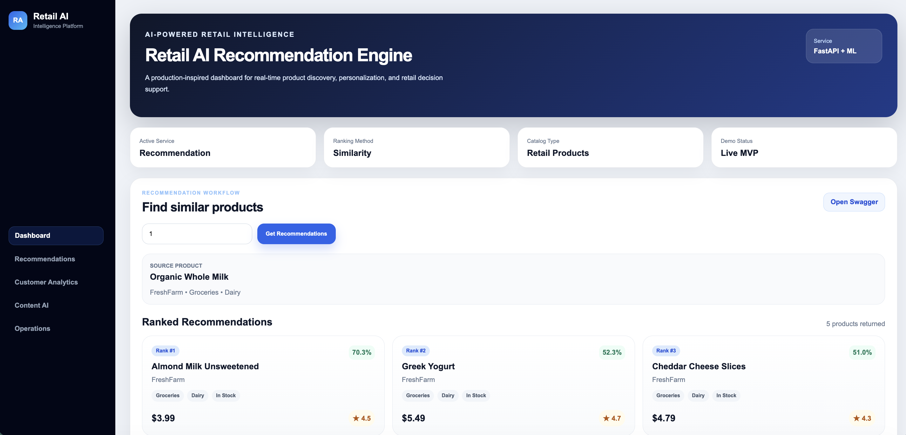

# 🛒 Retail AI Intelligence Platform

A production-inspired AI platform for retail intelligence, designed for large-scale commerce environments including grocery, electronics, fashion, and general merchandise.

---

## 🚀 Why This Project Matters

Modern retail systems require more than isolated machine learning models.

They need **end-to-end intelligent platforms** that can:
- Understand customer behavior
- Recommend relevant products
- Generate high-quality product content
- Provide actionable business insights

This project demonstrates how AI can be applied across the **entire retail lifecycle**.

---

## 🧠 Core Modules

### 🔹 Recommendation Service
- Content-based recommendation engine
- Similarity-based ranking
- Category-aware filtering

### 🔹 Content Intelligence Service *(In Progress)*
- AI-generated product titles and descriptions
- SEO metadata generation

### 🔹 Customer Analytics Service *(In Progress)*
- Customer segmentation
- Behavioral insights

### 🔹 Log Intelligence Service *(Planned)*
- Error detection
- Operational insights

---

## 🏗️ Architecture

```text
Frontend (React Dashboard)
        |
        v
API Layer (FastAPI Services)
        |
        ├── Recommendation Service
        ├── Content Intelligence Service
        ├── Customer Analytics Service
        └── Log Intelligence Service
        |
        v
Datasets + ML Models + Retail Knowledge Base
````

---

## 🖼️ Demo Screenshots

### 🛒 Retail AI Dashboard  
Production-inspired interface for retail intelligence systems


---

### 🤖 AI Recommendation Engine (Live Results)  
Real-time product recommendations with ranking and similarity scoring



---

### ⚙️ Backend API (Swagger)  
FastAPI-powered recommendation service with interactive API documentation


## 🛠️ Tech Stack

* **Frontend:** React, TypeScript, Vite
* **Backend:** FastAPI (Python)
* **ML/Data:** Pandas, Scikit-learn
* **Deployment:** Docker, Docker Compose
* **Domain:** Retail AI, Personalization, Content Intelligence

---

## 📊 Dataset Connection

This platform is designed to work with **retail product catalog datasets** and customer behavior data to power intelligent recommendations.

### Current Data Used

- Product Catalog Dataset (sample included)
- Features:
  - product_id
  - product_name
  - brand
  - category
  - sub_category
  - price
  - rating
  - stock_status
  - tags
  - description

### How Data is Used

- Recommendation engine uses **content-based similarity**
- Filters by **category and sub-category**
- Ranks products using similarity scoring

### Kaggle Profile

Explore full datasets and future releases:

👉 https://www.kaggle.com/noopurbhatt

## 📂 Project Structure

```text
retail-ai-intelligence-platform/
├── docs/
├── frontend/
├── services/
│   ├── recommendation-service/
│   ├── content-intelligence-service/
│   ├── customer-analytics-service/
│   └── log-intelligence-service/
├── datasets/
├── notebooks/
└── scripts/
```

---

## 🔌 API Documentation (Swagger)

Run the recommendation service and open:

```text
http://127.0.0.1:8001/docs
```

### Available Endpoints:

* `GET /health` → Health check
* `GET /products` → Retrieve product catalog
* `GET /recommendations/{product_id}` → Get ranked recommendations
* `POST /content/generate` → Generate product title, descriptions, bullets, and SEO metadata

---

## 📊 API Example

### Request

```http
GET /recommendations/1?top_k=5
```

### Response

```json
{
  "query": {
    "product_id": 1,
    "top_k": 5
  },
  "source_product": {
    "product_id": 1,
    "product_name": "Sample Product",
    "brand": "BrandX",
    "category": "Electronics",
    "sub_category": "Headphones"
  },
  "recommendation_count": 5,
  "recommendations": [
    {
      "rank": 1,
      "product_id": 7,
      "product_name": "Wireless Headphones",
      "brand": "BrandY",
      "category": "Electronics",
      "sub_category": "Headphones",
      "price": 59.99,
      "rating": 4.5,
      "stock_status": "In Stock",
      "similarity_score": 0.8123
    }
  ]
}
```

---

## 🧪 How to Run (Recommendation Service)

```bash
cd services/recommendation-service

python3 -m venv venv
source venv/bin/activate

pip install -r requirements.txt

uvicorn app.main:app --reload --port 8001
```

---

## 🔬 Research Alignment

This project supports research in:

* Retail Recommendation Systems
* AI-powered Content Generation
* Customer Behavior Analytics
* Scalable Retail Intelligence Platforms

---

## 🛣️ Roadmap

* [x] Recommendation Engine API
* [x] Swagger API Documentation
* [x] Content Intelligence Service MVP
* [ ] Customer Analytics Service
* [ ] Frontend Dashboard Integration
* [ ] Dockerized Full Platform
* [ ] Kaggle Dataset Integration
* [ ] End-to-End Demo

---

## 👩‍💻 Author

**Noopur Bhatt**
AI & Full-Stack Engineer specializing in **Retail Intelligence Systems, Personalization, and Scalable AI Platforms**

---

## ⭐ Future Vision

This platform aims to evolve into a **production-scale retail intelligence system**, demonstrating how AI can power modern commerce platforms end-to-end.
