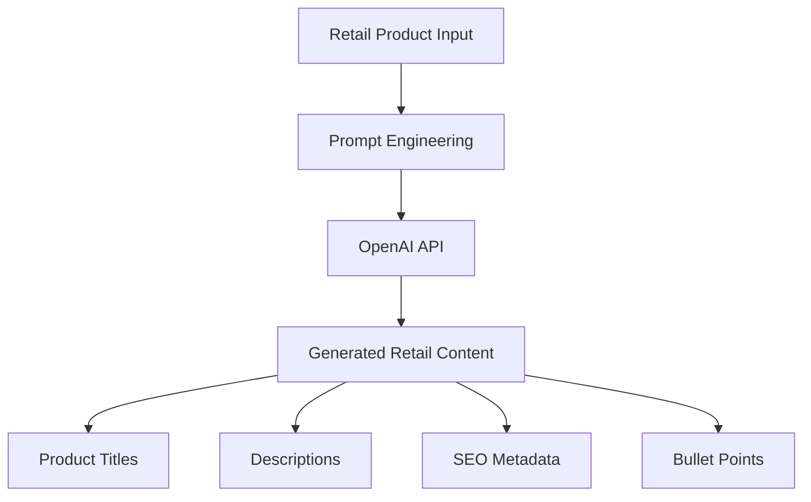

# ✍️ Content Intelligence Service API

## Overview

The Content Intelligence Service provides AI-powered retail content generation workflows using OpenAI models.

The service is designed to simulate enterprise merchandising and commerce content systems used in modern retail platforms.

---

# 🚀 Service Information

| Property | Value |
|---|---|
| Service Name | Content Intelligence Service |
| Framework | FastAPI |
| Default Port | 8002 |
| AI Provider | OpenAI |

---

# 🔌 API Base URL

```text
http://localhost:8002
```

---

# 📚 Swagger Documentation

```text
http://localhost:8002/docs
```

---

# 🧠 Core Capabilities

- Product title generation
- Product description generation
- SEO metadata generation
- Product bullet point creation
- AI-powered merchandising workflows

---

# ⚡ Content Generation Workflow



---

# 📦 Example Request Workflow

```text
Product Information
        ↓
Prompt Construction
        ↓
OpenAI Content Generation
        ↓
Structured Retail Content
```

---

# 🔍 Example API Endpoint

## POST `/generate-content`

### Purpose

Generate AI-powered retail product content.

---

## Example Request

```json
{
  "product_name": "Wireless Bluetooth Headphones",
  "brand": "SoundWave",
  "category": "Electronics"
}
```

---

## Example Response

```json
{
  "title": "Premium Wireless Bluetooth Headphones",
  "description": "Experience immersive sound quality with advanced wireless connectivity...",
  "seo_title": "Wireless Bluetooth Headphones - Premium Audio Experience",
  "seo_description": "Discover premium wireless headphones with immersive sound and all-day comfort.",
  "bullet_points": [
    "High-quality wireless audio",
    "Long battery life",
    "Comfortable over-ear design"
  ]
}
```

---

# 🧠 AI Concepts Demonstrated

This service explores:

- Generative AI workflows
- Prompt engineering
- AI-powered merchandising
- Retail content automation
- Commerce content intelligence

---

# 🛠️ Local Development

```bash
cd services/content-intelligence-service

python3 -m venv venv
source venv/bin/activate

pip install -r requirements.txt

export OPENAI_API_KEY="your_api_key_here"

python -m uvicorn app.main:app --reload --port 8002
```

---

# 🚀 Future Enhancements

Planned future improvements:

- Multi-language retail content
- AI localization workflows
- Brand-aware generation
- Product tone customization
- Bulk content generation
- Content approval workflows