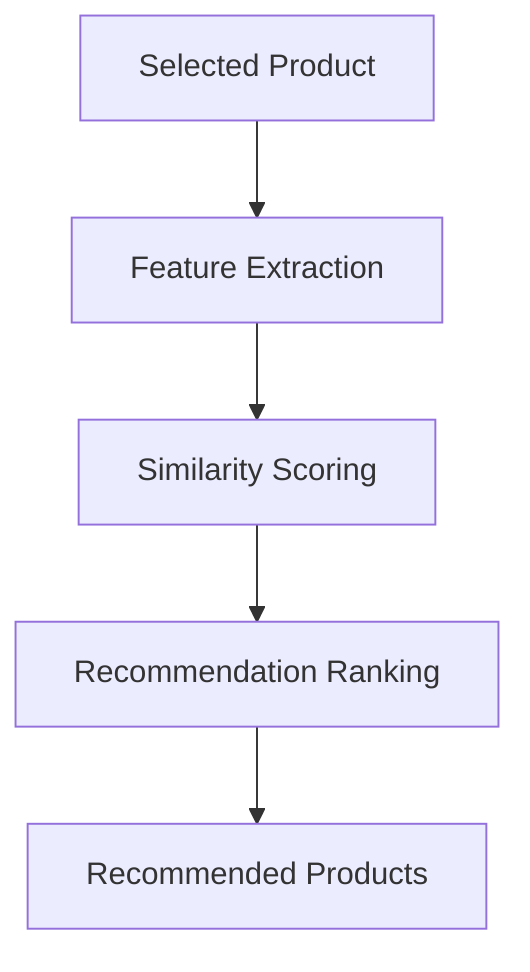

# 🤖 Recommendation Service API

## Overview

The Recommendation Service provides AI-powered retail recommendation workflows for product discovery and similarity search.

The service is designed to simulate enterprise recommendation systems used in modern commerce platforms.

---

# 🚀 Service Information

| Property | Value |
|---|---|
| Service Name | Recommendation Service |
| Framework | FastAPI |
| Default Port | 8001 |
| Recommendation Type | Content-Based Filtering |

---

# 🔌 API Base URL

```text
http://localhost:8001
```

---

# 📚 Swagger Documentation

```text
http://localhost:8001/docs
```

---

# 🛍️ Core Capabilities

- Product similarity search
- Recommendation ranking
- Category-aware discovery
- Retail product retrieval
- Semantic recommendation workflows

---

# ⚡ Recommendation Workflow



---

# 📊 Dataset Integration

The recommendation service uses:

## Retail Product Catalog Dataset

Dataset features include:

- Product metadata
- Categories
- Product descriptions
- Ratings
- Tags
- Retail attributes

---

# 🔍 Recommendation Features

The engine uses:

- Product descriptions
- Product categories
- Tags
- Retail metadata
- Similarity scoring workflows

---

# 📦 Example API Endpoint

## GET `/recommendations/{product_id}`

### Purpose

Retrieve recommended products based on similarity scoring.

---

## Example Request

```text
GET /recommendations/101
```

---

## Example Response

```json
{
  "product_id": 101,
  "recommendations": [
    {
      "product_id": 205,
      "product_name": "Wireless Bluetooth Headphones",
      "similarity_score": 0.91
    },
    {
      "product_id": 302,
      "product_name": "Portable Smart Speaker",
      "similarity_score": 0.87
    }
  ]
}
```

---

# 🧠 AI Concepts Demonstrated

This service explores:

- Recommendation systems
- Similarity search
- Content-based filtering
- Retail product discovery
- AI-powered commerce workflows

---

# 🛠️ Local Development

```bash
cd services/recommendation-service

python3 -m venv venv
source venv/bin/activate

pip install -r requirements.txt

python -m uvicorn app.main:app --reload --port 8001
```

---

# 🚀 Future Enhancements

Planned future improvements:

- Hybrid recommendation pipelines
- Collaborative filtering
- Semantic recommendations
- Recommendation explanations
- Personalized customer scoring
- Real-time recommendation APIs