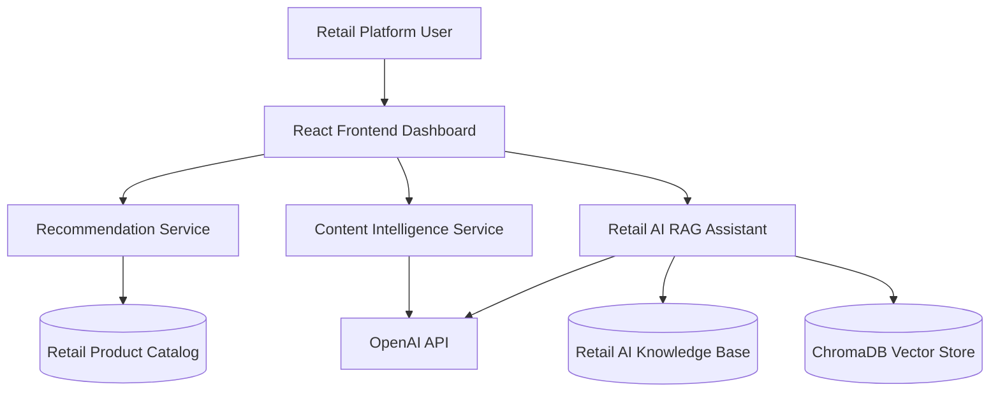
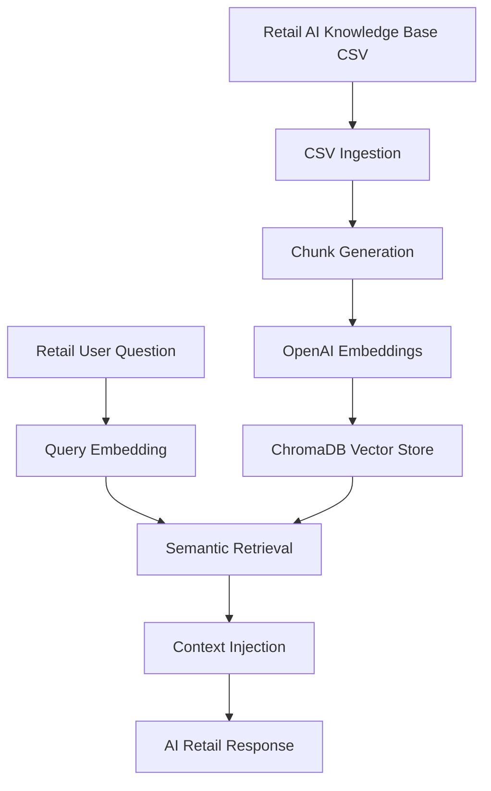

# 🔄 End-to-End User Workflow

## Overview

This document explains how users interact with the Retail AI Intelligence Platform across recommendation workflows, AI content generation, and semantic retail retrieval.

The platform demonstrates how multiple AI systems can work together inside modern commerce environments.

---

# 🧠 High-Level User Journey



---

# 🛍️ Workflow 1 — Product Recommendations

## User Flow

```text
User selects a product
        ↓
Recommendation service receives product ID
        ↓
Similarity scoring workflow runs
        ↓
Related products retrieved
        ↓
Recommendations displayed in UI
```

---

## AI Concepts Used

- Recommendation systems
- Similarity search
- Product discovery
- Recommendation ranking

---

# ✍️ Workflow 2 — AI Content Generation

## User Flow

```text
User enters product information
        ↓
Frontend sends content generation request
        ↓
Prompt engineering workflow executes
        ↓
OpenAI generates retail content
        ↓
Generated content displayed in dashboard
```

---

## Generated Content

- Product titles
- Product descriptions
- SEO metadata
- Bullet points
- Merchandising content

---

# 🔎 Workflow 3 — Retail AI RAG Assistant

## User Flow

```text
User asks retail intelligence question
        ↓
Question embedding generated
        ↓
ChromaDB semantic retrieval executes
        ↓
Relevant retail knowledge retrieved
        ↓
Context injected into OpenAI prompt
        ↓
AI-generated retail answer returned
```

---

# 📊 RAG Dataset Workflow



---

# 🧩 Frontend Workflow

The React frontend acts as the orchestration layer between users and AI services.

Responsibilities include:

- API communication
- Recommendation rendering
- AI content display
- Retail AI chat workflows
- User interaction handling

---

# ⚡ FastAPI Service Workflow

Each service operates independently:

| Service | Responsibility |
|---|---|
| Recommendation Service | Product discovery workflows |
| Content Intelligence Service | AI-generated merchandising content |
| Retail AI RAG Assistant | Semantic retail retrieval |

---

# 🧠 Enterprise AI Concepts Demonstrated

This platform demonstrates:

- AI microservices
- Retrieval-Augmented Generation (RAG)
- Recommendation systems
- Semantic vector search
- OpenAI integration
- Retail intelligence workflows
- AI-powered commerce systems

---

# 🚀 Future Workflow Expansion

Planned future workflows include:

- AI shopping assistants
- Conversational retail memory
- Recommendation explanations
- Personalized retail copilots
- AI merchandising analytics
- Customer intelligence systems

---

# 🎯 Workflow Vision

The long-term goal is to demonstrate how recommendation systems, semantic retrieval, and generative AI can work together inside scalable enterprise retail AI ecosystems.