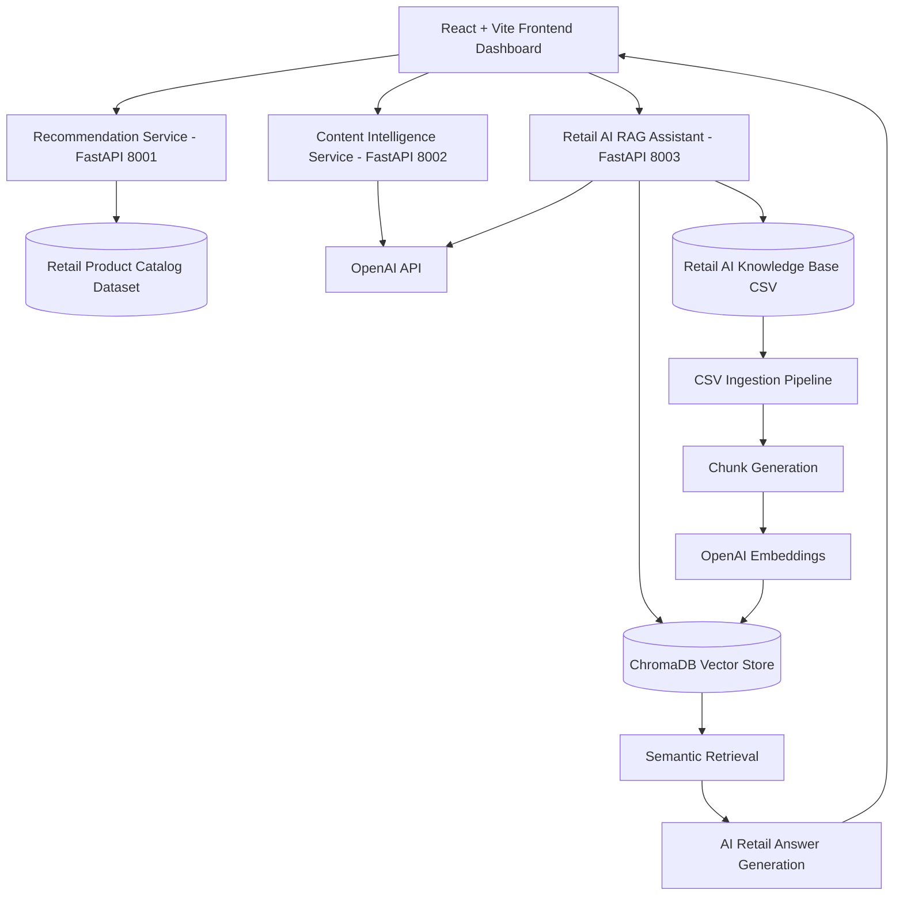

# 🏗️ Retail AI Intelligence Platform Architecture

## Overview

The Retail AI Intelligence Platform is a multi-service AI ecosystem designed to demonstrate how modern commerce systems can integrate:

- Recommendation Intelligence
- Generative AI Content Workflows
- Retrieval-Augmented Generation (RAG)
- Semantic Search
- Vector Databases
- Retail Knowledge Systems

The platform is structured using independent FastAPI microservices connected through a React frontend.

---

# 🎯 Architecture Goals

This platform explores practical enterprise AI patterns for retail systems:

- Scalable AI microservices
- Semantic retail retrieval
- Recommendation workflows
- AI-powered merchandising
- Retail content intelligence
- Dataset-driven RAG pipelines
- Vector search architecture
- Commerce AI orchestration

---

# 🧠 High-Level Platform Flow

## Visual Architecture Diagram



```text
Frontend Dashboard (React)
            │
            ▼
────────────────────────────────────
Retail AI Service Layer (FastAPI)
────────────────────────────────────
│
├── Recommendation Intelligence Service
│
├── Content Intelligence Service
│
└── Retail AI RAG Assistant Service
            │
            ▼
────────────────────────────────────
AI / Data Layer
────────────────────────────────────
│
├── OpenAI APIs
├── ChromaDB Vector Store
├── Retail Knowledge Base Dataset
└── Retail Product Catalog Dataset
````

---

# 🧩 Core Platform Services

## 🛒 Recommendation Intelligence Service

### Purpose

Provides AI-powered recommendation workflows for retail product discovery.

### Capabilities

* Product similarity search
* Recommendation ranking
* Category-aware retrieval
* Semantic recommendation workflows
* Product discovery systems

### Technologies

* FastAPI
* Scikit-learn
* Pandas
* TF-IDF similarity workflows

---

## ✍️ Content Intelligence Service

### Purpose

Generates AI-powered retail product content and merchandising metadata.

### Capabilities

* Product title generation
* Long-form product descriptions
* SEO metadata generation
* Product bullet points
* Merchandising content workflows

### Technologies

* FastAPI
* OpenAI APIs
* Prompt engineering workflows

---

## 🧠 Retail AI RAG Assistant Service

### Purpose

Provides Retrieval-Augmented Generation (RAG) workflows for semantic retail intelligence.

### Capabilities

* Retail knowledge ingestion
* CSV dataset ingestion
* OpenAI embeddings
* ChromaDB vector storage
* Semantic retrieval
* AI-powered retail Q&A
* Commerce intelligence workflows

### Technologies

* FastAPI
* OpenAI Embeddings
* ChromaDB
* Vector search architecture
* Semantic retrieval pipelines

---

# 🧠 Retail AI RAG Pipeline

```text
Retail AI Knowledge Base Dataset
                │
                ▼
CSV Ingestion Pipeline
                │
                ▼
Chunk Generation
                │
                ▼
OpenAI Embedding Generation
                │
                ▼
ChromaDB Vector Storage
                │
                ▼
Semantic Similarity Retrieval
                │
                ▼
LLM Context Injection
                │
                ▼
Retail AI Answer Generation
```

---

# 🗂️ Data Sources

## Retail Product Catalog Dataset

Used for:

* Product similarity workflows
* Recommendation ranking
* Product discovery systems

---

## Retail AI Knowledge Base Dataset

Used for:

* Semantic retrieval
* RAG pipelines
* AI-powered retail Q&A
* Commerce intelligence workflows

Dataset characteristics:

* 100K+ records
* Multi-category retail coverage
* AI use case mappings
* Semantic retrieval tags
* Merchandising intelligence
* Customer segment workflows

---

# ⚡ Frontend Architecture

The frontend dashboard is built using:

* React
* Vite
* Modular component structure

### Frontend Responsibilities

* Recommendation workflows
* Content generation workflows
* Retail AI assistant UI
* API orchestration
* Enterprise dashboard experience

---

# 🐳 Infrastructure Architecture

## Containerization

All services are designed to run independently using Docker.

### Infrastructure Components

* Docker
* Docker Compose
* FastAPI microservices
* Local vector database
* React frontend server

---

# 🔌 API Architecture

Each service exposes independent REST APIs.

| Service                      | Port |
| ---------------------------- | ---- |
| Recommendation Service       | 8001 |
| Content Intelligence Service | 8002 |
| Retail AI RAG Assistant      | 8003 |
| Frontend Dashboard           | 5173 |

---

# 🧪 Development Workflow

```text
Dataset Engineering
        ↓
AI Service Development
        ↓
FastAPI APIs
        ↓
Frontend Integration
        ↓
Vector Retrieval Workflows
        ↓
Enterprise AI Dashboard
```

---

# 🚀 Enterprise AI Concepts Demonstrated

This project explores:

* Retrieval-Augmented Generation (RAG)
* Recommendation systems
* Semantic vector search
* AI-powered content generation
* Retail AI workflows
* Commerce intelligence systems
* Dataset-driven AI pipelines
* Vector database engineering
* Enterprise AI microservices

---

# 🛣️ Future Architecture Expansion

Planned future capabilities include:

* Conversational memory
* Recommendation explanations using RAG
* Streaming AI responses
* Retail analytics dashboards
* AI shopping assistant workflows
* Vector analytics monitoring
* Knowledge graph integration
* Production cloud deployment

---

# 🎯 Architectural Vision

The long-term goal of the Retail AI Intelligence Platform is to demonstrate how modern commerce ecosystems can integrate:

* recommendation intelligence,
* generative AI,
* semantic retrieval,
* vector search,
* intelligent merchandising,
* and enterprise AI workflows

inside scalable retail AI architectures.
