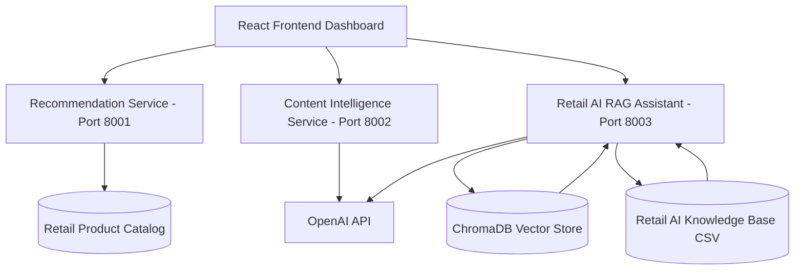

# 🧩 Service Architecture

## Overview

The Retail AI Intelligence Platform is built as a multi-service architecture where each AI capability is developed as an independent FastAPI service and connected through a React frontend dashboard.

---

## Service Architecture Diagram

---

## Services

| Service | Purpose |
|---|---|
| Frontend Dashboard | Unified user interface for all AI workflows |
| Recommendation Service | Product discovery and recommendation workflows |
| Content Intelligence Service | AI-generated product content and SEO metadata |
| Retail AI RAG Assistant | Semantic retrieval and AI-powered retail Q&A |

---

## Design Principles

- Independent microservices
- Clear API boundaries
- Retail-specific AI workflows
- Dataset-driven intelligence
- Frontend orchestration
- Docker-ready architecture

---

## Current Service Ports

| Service | Port |
|---|---|
| Frontend | 5173 |
| Recommendation Service | 8001 |
| Content Intelligence Service | 8002 |
| RAG Assistant Service | 8003 |