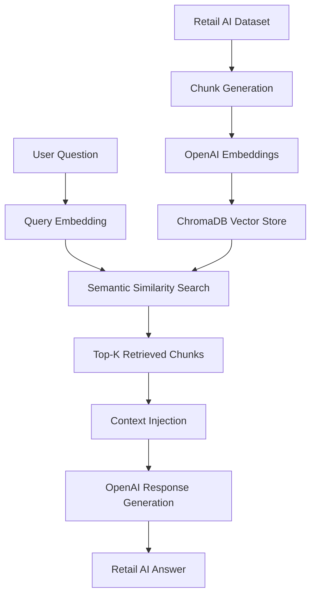

# 🔎 Vector Search Workflow

## Overview

The Retail AI Intelligence Platform uses semantic vector search to power Retrieval-Augmented Generation (RAG) workflows.

The vector retrieval system enables intelligent retail knowledge discovery using OpenAI embeddings and ChromaDB.

---

# 🧠 Why Vector Search?

Traditional keyword search depends on exact word matching.

Vector search enables:

- semantic understanding,
- intent-aware retrieval,
- context similarity,
- and intelligent commerce search workflows.

---

# ⚡ Vector Search Pipeline



---

# 📊 Retail Dataset Integration

The vector retrieval system uses:

## Retail AI Intelligence Knowledge Base

Dataset features:

- 100K+ retail intelligence records
- AI use case mappings
- Semantic retrieval tags
- Merchandising workflows
- Customer segment intelligence

---

# 🧩 Chunk Generation

Each CSV record is transformed into a semantic knowledge chunk.

Example:

```text
Category: Electronics
Topic: Product Discovery
Retail Problem: Low recommendation relevance
Retail Insight: Semantic retrieval improves recommendation quality...
```

---

# 🔍 Embedding Generation

The platform uses OpenAI embeddings to convert retail knowledge into semantic vectors.

This allows:

- semantic retrieval,
- context similarity,
- intelligent search,
- and AI-powered commerce reasoning.

---

# 🗂️ ChromaDB Vector Store

ChromaDB stores:

- embeddings,
- chunk metadata,
- semantic vectors,
- and retrieval context.

---

# ⚡ Retrieval Workflow

```text
User Question
      ↓
Generate Query Embedding
      ↓
Search Similar Vectors
      ↓
Retrieve Retail Context
      ↓
Inject Context into LLM
      ↓
Generate AI Response
```

---

# 🧠 AI Concepts Demonstrated

This workflow demonstrates:

- Retrieval-Augmented Generation (RAG)
- Semantic vector search
- OpenAI embeddings
- Vector databases
- Intelligent retrieval systems
- Enterprise AI retrieval pipelines

---

# 🚀 Future Improvements

Planned future enhancements:

- Hybrid retrieval pipelines
- Metadata filtering
- Multi-vector search
- Recommendation-aware retrieval
- Real-time vector analytics
- Cloud vector databases
- Retrieval observability dashboards