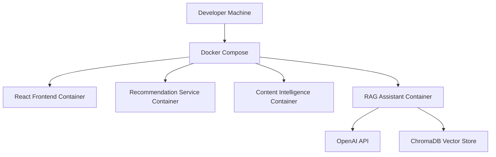

# 🐳 Docker Setup

## Overview

The Retail AI Intelligence Platform is designed as a Dockerized multi-service AI ecosystem.

Docker Compose is used to orchestrate:

- React frontend
- Recommendation service
- Content intelligence service
- Retail AI RAG assistant
- Vector retrieval workflows

---

# 🏗️ Platform Containers

| Service | Purpose | Default Port |
|---|---|---|
| Frontend Dashboard | React enterprise UI | 5173 |
| Recommendation Service | Product recommendation workflows | 8001 |
| Content Intelligence Service | AI-generated retail content | 8002 |
| Retail AI RAG Assistant | Semantic retrieval & RAG workflows | 8003 |

---

# 🚀 Start Entire Platform

From the project root:

```bash
docker compose up --build
```

---

# 🐳 Docker Workflow



---

# 🌐 Service URLs

| Service | URL |
|---|---|
| Frontend Dashboard | http://localhost:5173 |
| Recommendation API | http://localhost:8001/docs |
| Content Intelligence API | http://localhost:8002/docs |
| Retail AI RAG Assistant API | http://localhost:8003/docs |

---

# 🧠 Retail AI RAG Requirements

The RAG assistant requires:

- OpenAI API access
- ChromaDB vector storage
- Retail AI dataset ingestion

---

# 🔐 Environment Variables

Example:

```bash
export OPENAI_API_KEY="your_api_key_here"
```

---

# 📊 Dataset Setup

Place dataset:

```text
retail_ai_knowledge_base_100k.csv
```

inside:

```text
services/rag-assistant-service/app/data/csv/
```

---

# ⚡ CSV Ingestion Workflow

After containers start:

Open:

```text
http://localhost:8003/docs
```

Run:

```text
POST /ingest/csv
```

Recommended initial ingestion:

```text
limit = 1000
```

---

# 🧪 Test Retail AI Assistant

Example query:

```text
How can semantic search improve retail product discovery?
```

---

# 🛠️ Dockerized AI Concepts Demonstrated

This setup demonstrates:

- AI microservices
- Dockerized RAG systems
- Semantic retrieval workflows
- OpenAI integrations
- Vector search pipelines
- Enterprise AI orchestration

---

# 🚀 Future Infrastructure Plans

Planned future improvements:

- Kubernetes deployment
- CI/CD pipelines
- AWS deployment
- Cloud vector databases
- Monitoring & observability
- Distributed AI services